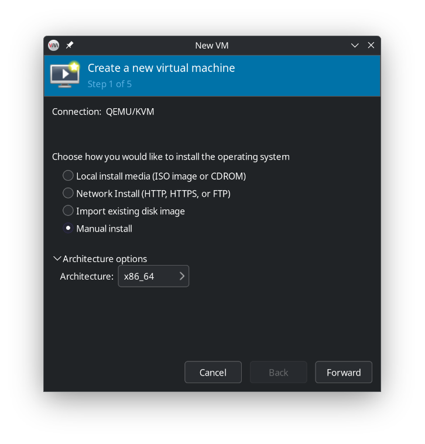
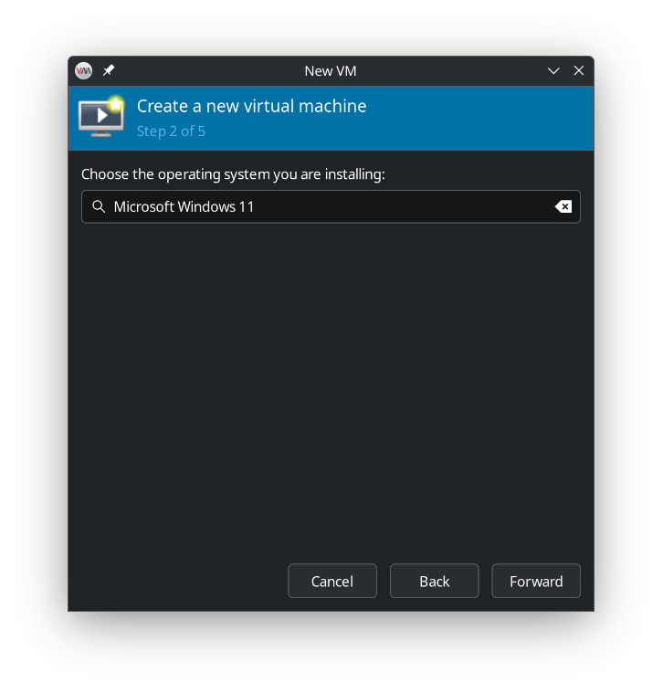
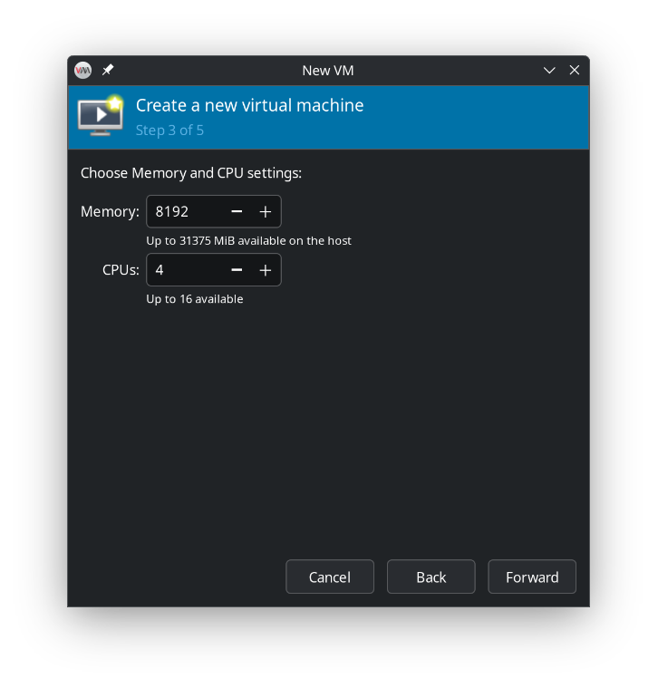
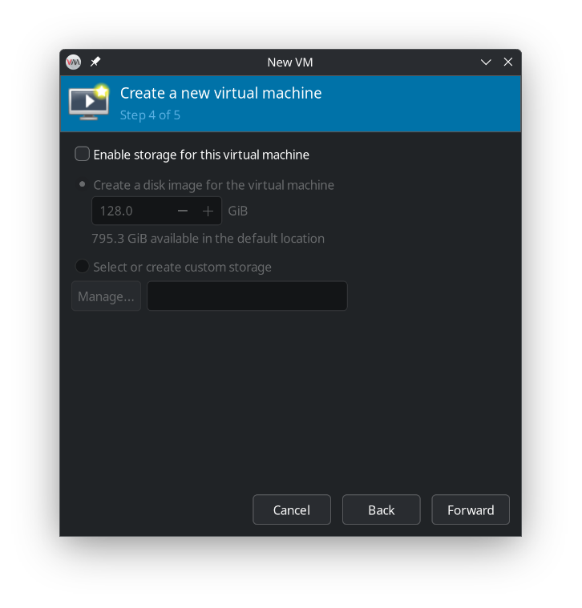
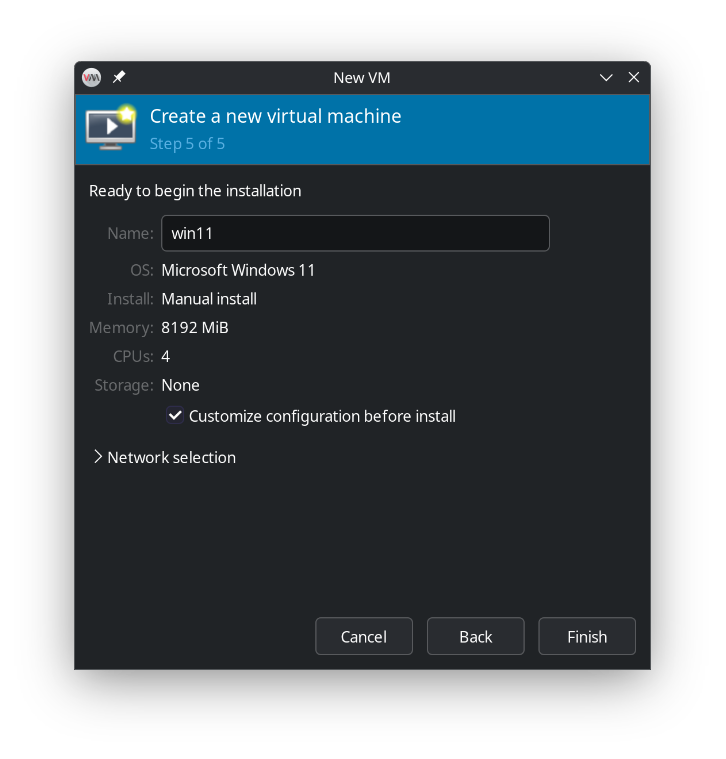
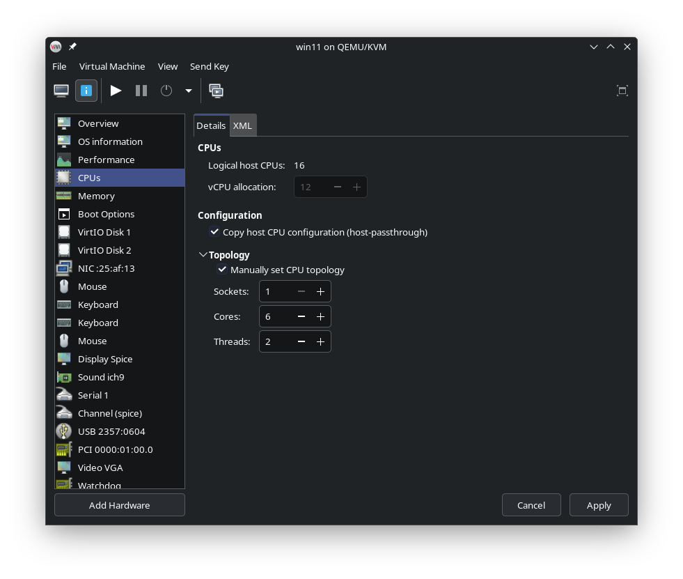
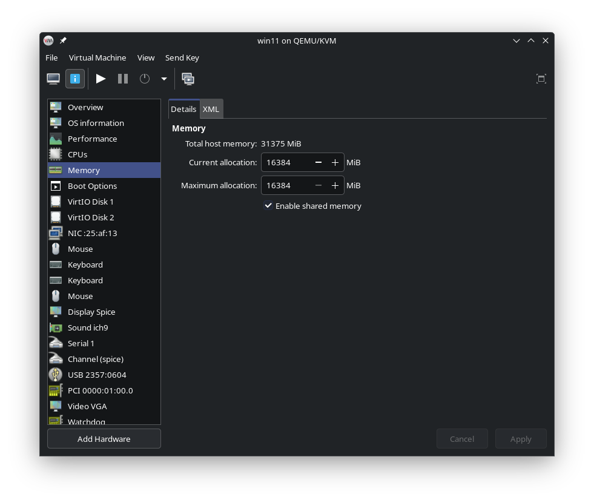
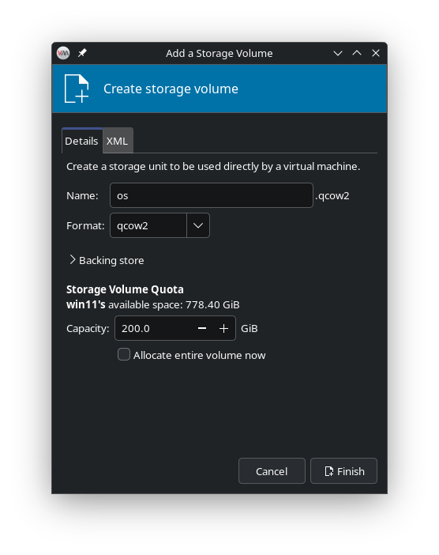
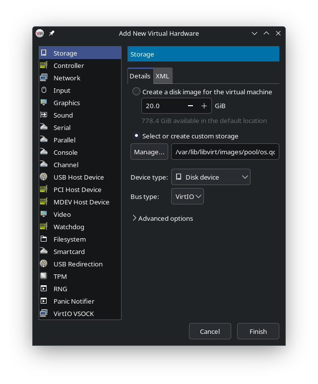
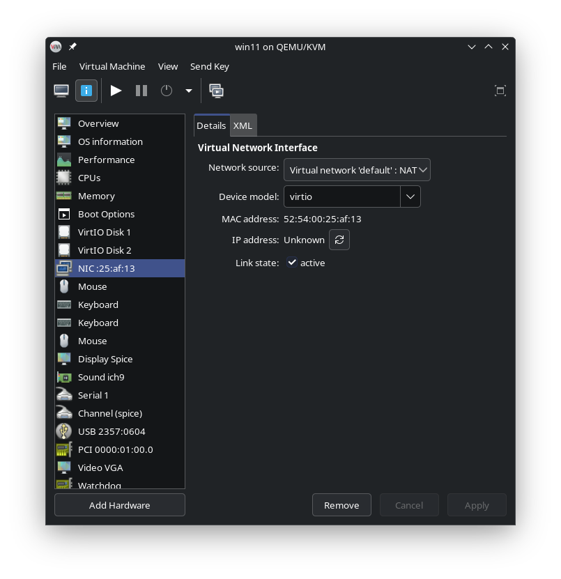

<h1> VM Configuration and Installation </h1>

This guide describes how to set up a Windows 11 virtual machine using **libvirt** and **Virtual Machine Manager**.

_Note: Enable XML editing in the Virtual Machine Manager settings for advanced configuration._

<h2> Table of Contents </h2>

- [Create a New Virtual Machine](#create-a-new-virtual-machine)
- [Configure the VM](#configure-the-vm)
  - [CPU Configuration](#cpu-configuration)
  - [Memory Configuration](#memory-configuration)
  - [Disk Configuration](#disk-configuration)
    - [Create a Virtual Disk](#create-a-virtual-disk)
    - [Use a Physical Disk](#use-a-physical-disk)
  - [Network Configuration](#network-configuration)
  - [GPU Passtrough](#gpu-passtrough)
  - [TPM](#tpm)
- [Install Windows 11](#install-windows-11)
  - [Prerequisites](#prerequisites)
  - [Adding ISO Files to the VM](#adding-iso-files-to-the-vm)
  - [Initial Windows Installation and Setup](#initial-windows-installation-and-setup)
- [Use VirtIO bus type for physical boot device](#use-virtio-bus-type-for-physical-boot-device)

## Create a New Virtual Machine

Follow these steps in **Virtual Machine Manager** to create your Windows 11 VM:

**Step 1:**  
Open Virtual Machine Manager and click **"Create a new virtual machine"**. Select **"Manual install"** as the installation method.  


**Step 2:**  
Choose **"Microsoft Windows 11"** as the operating system type.  


**Step 3:**  
Set your desired amount of memory (RAM). You can adjust this later if needed. Ignore the CPU configuration for now. This will be configured later.  


**Step 4:**  
If you plan to use an existing physical Windows installation (or plan to install Windows to a separate physical storage), deselect the option to create a new virtual disk. Otherwise, you can create a new virtual storage device now or add one later (this is covered in a later section).  


**Step 5:**  
Enter a name for your new VM and check **"Customize configuration before install"** to adjust advanced settings before starting the installation.  


## Configure the VM

### CPU Configuration

1. **Select CPU Mode:**  
   In the configuration section, choose **host-passthrough** to expose all host CPU features to the VM.

2. **Set CPU Topology:**  
   Determine your CPU topology using the command:

   ```bash
   lscpu
   ```
   Use this information to set the number of sockets, cores, and threads in the VM settings.

   

   _Example:_  
   My CPU has two **threads per core**. I want to assign six out of eight **physical cores** to the VM. `lscpu` shows I have 1 **socket**. This results in passing 12 out of 16 vCPUs to the VM.

3. **(Optional) Advanced XML Configuration:**  
   After applying your settings, switch to the XML view for additional recommended options:

   ```xml
   <cpu mode="host-passthrough" check="none" migratable="on">
       <topology sockets="1" dies="1" clusters="1" cores="6" threads="2"/>
       <cache mode="passthrough"/>
       <feature policy="require" name="invtsc"/>
       <feature policy="require" name="topoext"/>
   </cpu>
   ```

   - **cache mode="passthrough"**  
     Passes the host's CPU cache topology to the VM, improving compatibility and sometimes performance.

   - **invtsc**  
     Enables the **invtsc** (Invariant TSC) feature, providing a stable and monotonic time source for the VM. This is especially important for Windows guests.

   - **topoext**  
     Enables the **topoext** (Topology Extensions) feature, allowing the guest OS to correctly detect the CPU topology. This is particularly relevant for AMD CPUs.

---

### Memory Configuration

Set the amount of memory for the VM and check **"Enable shared memory"** for better performance.



---

### Disk Configuration

#### Create a Virtual Disk

1. Click **"Add Hardware"**. In the left menu, choose **"Storage"**.
2. In the storage section, check **"Select or create custom storage"** and click **"Manage"**.
3. It is recommended to create a new **storage pool** for the VM, but using the default pool is also fine. When creating a new pool, select **"dir: Filesystem Directory"** and choose a target path. This path will store the file representing your VM's virtual disk.

   

4. Under the desired storage pool, create a new volume for the operating system. Choose **"qcow2"** and the desired size. You do not need to allocate the entire volume now.
5. Click **"Finish"** to create the storage. Select the newly created storage and click **"Choose Volume"**.

   

6. Before finishing, set **"Disk device"** as the **Device type** and **"VirtIO"** as the **Bus type**.
7. In **Advanced options**, set **Cache mode** to **"none"** and **Discard mode** to **"unmap"**.

#### Use a Physical Disk

1. **Get the disk ID:**

    List all physical disks and their `/dev/disk/by-id` symlink paths:
    ```bash
    lsblk -nd -o NAME,SIZE,TYPE | awk '$3=="disk" { cmd = "find /dev/disk/by-id -lname \"*/" $1 "\" -printf \"%p \""; cmd | getline id; close(cmd); print $1 "\t" $2 "\t" id }'
    ```
    Copy the symlink path of the desired disk (either with an existing Windows installation or for a new installation).

2. **Add the device to the VM:**

    - Click **"Add Hardware"**. In the left menu, choose **"Storage"**.
    - In the storage section, check **"Select or create custom storage"** and paste the copied symlink path.
    - Set **Device type** to **"Disk device"** and **Bus type** to **"SATA"**.

---

### Network Configuration

For best performance, change the **Device model** for the network interface to **virtio**.



---

### GPU Passtrough

Click **"Add Hardware"** and select **"PCI Host Device"** on the left.


Select your GPU from the list (e.g., RTX 4070 SUPER). Adding the audio controller is optional.

Click **"Finish"**.

---

### TPM

Windows 11 required a TPM device. If not bypassed add a TPM device of type **Emulated** under **Add Hardware**. This requires the package **swtpm** to be installed.

---

_Do not click **Begin Installation** yet and proceed with the next section._

## Install Windows 11

### Prerequisites  
- Download the latest **VirtIO driver** `.iso` for Windows guests from [this repository](https://github.com/qemus/virtiso/releases).  
- Download a **Windows 11** ISO file.

---

### Adding ISO Files to the VM  

1. In your VM settings, click **Add Hardware** and select **Storage**.  
2. Under **Storage**, check **Select or create custom storage** and click **Manage**.  
3. Choose your **storage pool** (use the one you created earlier, or the default pool if none was created).  
4. Click **Browse Local** and locate the ISO file you want to add.  
5. Select the ISO file from the list and click **Choose Volume**.  
6. Set the following:  
   - **Device type:** `CDROM device`  
   - **Bus type:** `SATA`  

Repeat these steps for **both** ISO files:  
- The **Windows 11** ISO  
- The **VirtIO drivers** ISO

_Note: After the installation, you may remove the Windows and VirtIO ISO files from the virtual machine configuration and the storage pool, and delete the corresponding files from the host system._

---

### Initial Windows Installation and Setup

1. **Start the Installation**  
   - Click **Begin Installation** in the top-left corner.  
   - The VM will boot for the first time.  
   - During the POST screen, you may see a message prompting you to press any key to boot from the CD-ROM — do this to boot from the Windows 11 ISO.  
   - Alternatively, you can configure the boot order in the VM settings to prioritize the Windows 11 ISO.

2. **Load VirtIO Drivers (if using VirtIO Disk Bus)**  
   - If you created a virtual disk with the **VirtIO** bus type, it will not appear in the Windows installer by default.  
   - Click **Load Driver**, then **Browse**.  
   - Select the CD drive containing the VirtIO ISO.  
   - Navigate to:  
     ```
     viostor/w11/amd64
     ```  
   - Click **OK**, select **Red Hat VirtIO SCSI Controller** from the list, and click **Next**.  
   - The virtual disk should now appear, allowing you to proceed with the installation.

3. **Bypass Microsoft Account Requirement (Optional)**  
   - After installation, proceed through the Windows first-time setup.  
   - To avoid being forced to sign in with a Microsoft account:  
     - Disconnect your computer from the internet.  
     - Press **Shift + F10** to open Command Prompt.  
     - Enter the following command:  
       ```
       OOBE\BYPASSNRO
       ```  
     - The setup will restart, and you can now choose an offline installation.

4. **Install Guest Additions**  
   - Inside Windows 11, download the **SPICE Guest Tools** from:  
     [spice-guest-tools-latest.exe](https://www.spice-space.org/download/windows/spice-guest-tools/spice-guest-tools-latest.exe)  
     (More information: [spice-space.org/download.html](https://www.spice-space.org/download.html))  
   - Install the guest additions.

5. **Install GPU Drivers**  
   - Ensure you install the correct GPU drivers for your hardware.

6. **Optional: Enable a Seamless Experience**  
   - At this stage, you can connect a display to your GPU and pass through peripherals (e.g., mouse and keyboard) directly to the VM.  
   - For an seamless experience, set up **Looking Glass** as described in the main section of this guide.

---

## Use VirtIO bus type for physical boot device

If you want to switch use the **VirtIO** bus type on your phsycial boot device, follow these steps:

1. **Initial Boot with SATA**  
   - Configure the VM’s boot disk to use the **SATA** bus type.  
   - Start the VM.

2. **Enable Safe Mode**  
   - Inside Windows, open an **elevated Command Prompt** (Run as Administrator).  
   - Enter the following command to set the system to boot into Safe Mode:  
     ```
     bcdedit /set "{current}" safeboot minimal
     ```
   - Shut down the VM.

3. **Switch to VirtIO**  
   - Change the VM’s boot disk bus type from **SATA** to **VirtIO**.  
   - Start the VM — it will boot into Safe Mode.  

   **Why this works:**  
   Booting into Safe Mode automatically enables and loads all boot-start drivers, including VirtIO. Since the VirtIO driver is now active, Windows will add it to the list of drivers loaded at boot.

4. **Disable Safe Mode**  
   - Once in Safe Mode, open an **elevated Command Prompt** again.  
   - Run the following command to disable Safe Mode for the next boot:  
     ```
     bcdedit /deletevalue "{current}" safeboot
     ```
   - Shut down the VM.

5. **Final Boot with VirtIO**  
   - Ensure the boot disk is still configured with the **VirtIO** bus type.  
   - Start the VM — it should now boot normally using VirtIO.
